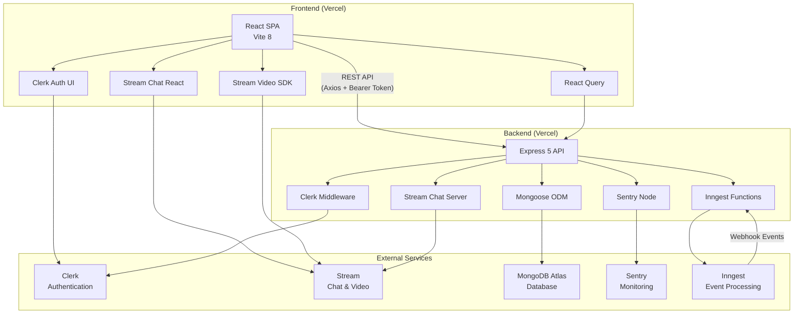
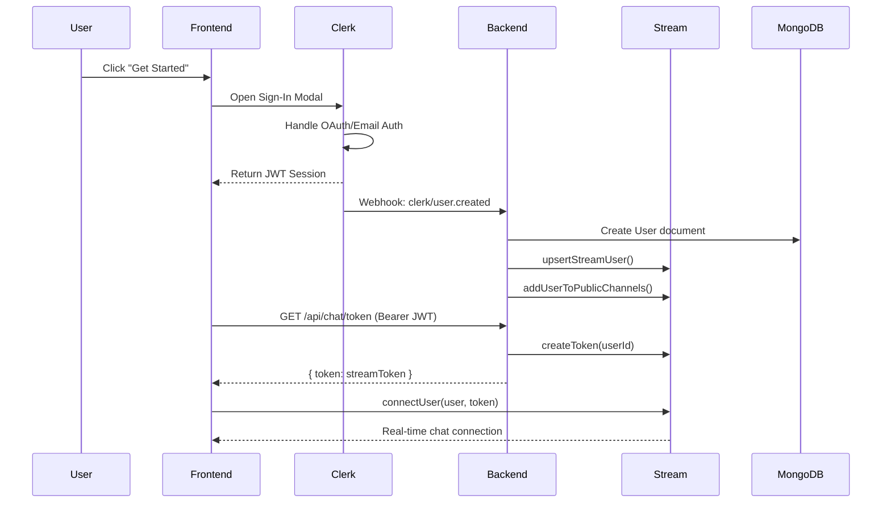

# Synchronous Communication Hub — Full Project Report

**Date:** April 21, 2026  
**Author:** Auto-generated via codebase analysis  
**Repository:** `Jaish009/Synchronous-Communication-Hub`  
**Total Commits:** 31  

---

## 1. Executive Summary

The **Synchronous Communication Hub** is a full-stack, real-time team communication platform modelled after Slack. It provides instant messaging (channels & direct messages), video calling, file sharing, message pinning, user presence, and channel management — all wrapped in a premium, dark-themed UI with custom animations.

The application follows a **decoupled client-server architecture** deployed across two Vercel projects:

| Layer | Stack |
|-------|-------|
| **Frontend** | React 19 · Vite 8 · TailwindCSS 4 · Stream Chat React · Stream Video React SDK · Framer Motion |
| **Backend** | Express 5 · Node.js · MongoDB (Mongoose 8) · Stream Chat Server · Inngest |
| **Auth** | Clerk (frontend + backend) |
| **Monitoring** | Sentry (frontend + backend) |
| **Deployment** | Vercel (both frontend & backend) |

---

## 2. Technology Stack — Deep Dive

### 2.1 Frontend Dependencies

| Package | Version | Purpose |
|---------|---------|---------|
| `react` | ^19.2.4 | UI library |
| `react-dom` | ^19.2.4 | DOM renderer |
| `react-router` | ^7.6.3 | Client-side routing |
| `stream-chat` | ^9.14.0 | Stream Chat JS client |
| `stream-chat-react` | ^13.3.0 | Pre-built chat UI components |
| `@stream-io/video-react-sdk` | ^1.34.2 | Video/audio calling |
| `@clerk/clerk-react` | ^5.61.3 | Authentication UI components |
| `@tanstack/react-query` | ^5.96.2 | Server-state management & caching |
| `motion` | ^12.38.0 | Animations (Framer Motion) |
| `lucide-react` | ^1.7.0 | SVG icon library |
| `react-hot-toast` | ^2.5.2 | Toast notifications |
| `@sentry/react` | ^10.47.0 | Error tracking & performance monitoring |
| `tailwindcss` | ^4.2.2 | Utility-first CSS (via Vite plugin) |
| `axios` | (via lib) | HTTP client for API calls |

**Dev tooling:** Vite 8, ESLint 9, `@vitejs/plugin-react` 6.

### 2.2 Backend Dependencies

| Package | Version | Purpose |
|---------|---------|---------|
| `express` | ^5.1.0 | HTTP framework |
| `mongoose` | ^8.16.5 | MongoDB ODM |
| `stream-chat` | ^8.60.0 | Stream Chat server SDK |
| `@clerk/express` | ^1.7.4 | Clerk middleware for Express |
| `inngest` | ^3.40.1 | Event-driven background functions |
| `cors` | ^2.8.6 | Cross-Origin Resource Sharing |
| `dotenv` | ^17.2.1 | Environment variable loading |
| `@sentry/node` | ^10.47.0 | Server-side error tracking |

**Dev tooling:** Nodemon 3.

### 2.3 Environment Variables

The project requires **12 environment variables** across both services:

#### Backend `.env`
| Variable | Description |
|----------|-------------|
| `PORT` | Server port (default 5001) |
| `MONGO_URI` | MongoDB connection string |
| `NODE_ENV` | Runtime environment |
| `CLERK_PUBLISHABLE_KEY` | Clerk public key |
| `CLERK_SECRET_KEY` | Clerk secret key |
| `STREAM_API_KEY` | Stream API key |
| `STREAM_API_SECRET` | Stream API secret |
| `SENTRY_DSN` | Sentry Data Source Name |
| `INNGEST_EVENT_KEY` | Inngest event key |
| `INNGEST_SIGNING_KEY` | Inngest signing key |
| `CLIENT_URL` | Frontend URL for CORS |

#### Frontend `.env`
| Variable | Description |
|----------|-------------|
| `VITE_CLERK_PUBLISHABLE_KEY` | Clerk public key |
| `VITE_STREAM_API_KEY` | Stream API key |
| `VITE_API_BASE_URL` | Backend API base URL |
| `VITE_SENTRY_DSN` | Sentry DSN for frontend |

---

## 3. Architecture

### 3.1 High-Level Architecture



### 3.2 Authentication Flow



### 3.3 Data Flow — User Lifecycle

| Event | Trigger | Actions |
|-------|---------|---------|
| **User Created** | `clerk/user.created` webhook via Inngest | 1. Save to MongoDB  2. Upsert Stream user  3. Add to all public channels |
| **User Deleted** | `clerk/user.deleted` webhook via Inngest | 1. Delete from MongoDB  2. Delete Stream user |
| **User Signs In** | Clerk session established | 1. Fetch Stream token from backend  2. Connect to Stream Chat client |

---

## 4. Project Structure

```
Synchronous Communication Hub/
├── .gitignore
├── backend/
│   ├── .env                          # Backend environment variables
│   ├── instrument.mjs                # Sentry initialization (imported first)
│   ├── package.json
│   ├── vercel.json                   # Vercel serverless config
│   └── src/
│       ├── server.js                 # Express app entry point
│       ├── config/
│       │   ├── db.js                 # MongoDB connection
│       │   ├── env.js                # Environment variable aggregator
│       │   ├── inngest.js            # Inngest function definitions
│       │   └── stream.js             # Stream Chat server utilities
│       ├── controllers/
│       │   └── chat.controller.js    # Token generation endpoint
│       ├── middleware/
│       │   └── auth.middleware.js     # Route protection middleware
│       ├── models/
│       │   └── user.model.js         # Mongoose User schema
│       └── routes/
│           └── chat.route.js         # Chat API routes
│
└── frontend/
    ├── .env                          # Frontend environment variables
    ├── index.html                    # HTML entry point
    ├── package.json
    ├── vite.config.js                # Vite + TailwindCSS + React config
    ├── vercel.json                   # SPA rewrite rules
    └── src/
        ├── main.jsx                  # App bootstrap + providers
        ├── App.jsx                   # Routing (SentryRoutes)
        ├── index.css                 # Global styles
        ├── components/
        │   ├── CreateChannelModal.jsx # Channel creation form
        │   ├── CustomChannelHeader.jsx# Channel header with actions
        │   ├── CustomChannelPreview.jsx# Sidebar channel item
        │   ├── InviteModal.jsx       # Member invite dialog
        │   ├── MembersModal.jsx      # Channel members list
        │   ├── PageLoader.jsx        # Loading spinner
        │   ├── PinnedMessagesModal.jsx# Pinned messages viewer
        │   ├── ShinyText.jsx         # Animated gradient text
        │   ├── ShinyText.css         # ShinyText styles
        │   └── UsersList.jsx         # DM user list with presence
        ├── hooks/
        │   └── useStreamChat.js      # Stream Chat connection hook
        ├── lib/
        │   ├── api.js                # API function exports
        │   └── axios.js              # Axios instance config
        ├── pages/
        │   ├── AuthPage.jsx          # Landing/auth page (541 lines)
        │   ├── AuthPage.jsx.bak      # Backup of previous version
        │   ├── CallPage.jsx          # Video call page
        │   └── HomePage.jsx          # Main chat interface
        ├── providers/
        │   └── AuthProvider.jsx      # Axios auth interceptor
        └── styles/
            ├── auth.css              # Landing page styles (812 lines)
            ├── auth.css.bak          # Backup of previous version
            └── stream-chat-theme.css # Chat UI dark theme (1162 lines)
```

**Total Source Files:** 26 (excluding backups, configs, and node_modules)

---

## 5. File-by-File Source Walkthrough

### 5.1 Backend

#### [server.js](file:///d:/prototype/Synchronous%20Communication%20Hub/backend/src/server.js) — Entry Point (55 lines)
- Imports Sentry instrumentation before anything else
- Configures Express with JSON parsing, CORS (allowing frontend URL + `*.vercel.app`), and Clerk middleware
- Mounts Inngest webhook handler at `/api/inngest`
- Mounts chat routes at `/api/chat`
- Sets up Sentry error handler
- Conditionally starts HTTP server only in non-production (Vercel uses serverless)
- Exports `app` as default for Vercel

#### [config/env.js](file:///d:/prototype/Synchronous%20Communication%20Hub/backend/src/config/env.js) — Environment Config (16 lines)
- Centralizes all environment variables into a single `ENV` object
- Loads from `.env` via `dotenv/config`

#### [config/db.js](file:///d:/prototype/Synchronous%20Communication%20Hub/backend/src/config/db.js) — Database Connection (15 lines)
- Exports `connectDB()` — connects to MongoDB via Mongoose
- Exits process on connection failure

#### [config/stream.js](file:///d:/prototype/Synchronous%20Communication%20Hub/backend/src/config/stream.js) — Stream Utilities (42 lines)
- Creates a singleton Stream Chat server client
- Exports four utilities:
  - `upsertStreamUser(userData)` — Creates/updates a Stream user
  - `deleteStreamUser(userId)` — Removes a Stream user
  - `generateStreamToken(userId)` — Creates a JWT for client-side auth
  - `addUserToPublicChannels(userId)` — Auto-joins new users to discoverable channels

#### [config/inngest.js](file:///d:/prototype/Synchronous%20Communication%20Hub/backend/src/config/inngest.js) — Event Functions (50 lines)
- Defines two Inngest functions triggered by Clerk webhooks:
  - **`sync-user`** (`clerk/user.created`) — Saves user to MongoDB, upserts in Stream, auto-joins public channels
  - **`delete-user-from-db`** (`clerk/user.deleted`) — Removes user from MongoDB and Stream

#### [controllers/chat.controller.js](file:///d:/prototype/Synchronous%20Communication%20Hub/backend/src/controllers/chat.controller.js) — Chat Controller (18 lines)
- Single endpoint: `getStreamToken`
- Extracts `userId` from `req.auth` (Clerk), generates Stream token, returns as JSON

#### [middleware/auth.middleware.js](file:///d:/prototype/Synchronous%20Communication%20Hub/backend/src/middleware/auth.middleware.js) — Auth Guard (8 lines)
- `protectRoute` — Returns 401 if `req.auth.userId` is missing

#### [models/user.model.js](file:///d:/prototype/Synchronous%20Communication%20Hub/backend/src/models/user.model.js) — User Schema (28 lines)
- Fields: `email` (unique), `name`, `image`, `clerkId` (unique)
- Timestamps enabled

#### [routes/chat.route.js](file:///d:/prototype/Synchronous%20Communication%20Hub/backend/src/routes/chat.route.js) — Routes (10 lines)
- `GET /token` — Protected route returning a Stream Chat token

#### [instrument.mjs](file:///d:/prototype/Synchronous%20Communication%20Hub/backend/instrument.mjs) — Sentry Setup (15 lines)
- Initializes Sentry with 100% trace and profile sampling
- Includes local variables and default PII collection

---

### 5.2 Frontend

#### [main.jsx](file:///d:/prototype/Synchronous%20Communication%20Hub/frontend/src/main.jsx) — App Bootstrap (59 lines)
- Provider hierarchy: `StrictMode` → `ClerkProvider` → `BrowserRouter` → `QueryClientProvider` → `AuthProvider` → `App`
- Initializes Sentry with React Router v7 browser tracing integration
- Renders `Toaster` for toast notifications

#### [App.jsx](file:///d:/prototype/Synchronous%20Communication%20Hub/frontend/src/App.jsx) — Routing (55 lines)
- Uses `Sentry.withSentryReactRouterV7Routing(Routes)` for instrumented routing
- Routes:
  - `/` → `HomePage` (authenticated) or redirect to `/auth`
  - `/auth` → `AuthPage` (unauthenticated) or redirect to `/`
  - `/call/:id` → `CallPage` (authenticated)
  - `*` → Redirect based on auth state

#### [pages/AuthPage.jsx](file:///d:/prototype/Synchronous%20Communication%20Hub/frontend/src/pages/AuthPage.jsx) — Landing Page (541 lines)
- Full marketing landing page with 8 sections:
  1. **Hero** — Brand, tagline, CTA buttons (Sign In via Clerk modal)
  2. **Core Features** — 6 feature cards (Chat, Video, Polls, Screen Share, Files, Security)
  3. **Integrations** — Stream, Clerk, Sentry, Vercel badges
  4. **Live Activity** — Simulated real-time activity feed
  5. **Testimonials** — User quotes
  6. **Real-Time Presence** — Status, profiles, custom statuses
  7. **Responsive Design** — Mobile & adaptive UI highlights
  8. **FAQ Accordion** — 4 expandable questions
  9. **Bottom CTA** — Final conversion prompt
  10. **Footer** — Links + copyright
- Uses `IntersectionObserver` for scroll-reveal animations
- Extensive use of `ShinyText` animated gradient text component

#### [pages/HomePage.jsx](file:///d:/prototype/Synchronous%20Communication%20Hub/frontend/src/pages/HomePage.jsx) — Chat Interface (132 lines)
- Main application page after authentication
- Layout: Left sidebar (channel list + DM list) + Right panel (messages + input)
- Uses Stream Chat React components: `Chat`, `Channel`, `ChannelList`, `MessageList`, `MessageInput`, `Thread`, `Window`
- Active channel derived from URL search params (`?channel=...`)
- Custom components for channel preview, header, and channel creation modal

#### [pages/CallPage.jsx](file:///d:/prototype/Synchronous%20Communication%20Hub/frontend/src/pages/CallPage.jsx) — Video Calls (115 lines)
- Initializes Stream Video client with user credentials and token
- Joins or creates a call by ID from URL params
- Renders `SpeakerLayout` + `CallControls`
- Auto-navigates to `/` when call ends (`CallingState.LEFT`)

#### [hooks/useStreamChat.js](file:///d:/prototype/Synchronous%20Communication%20Hub/frontend/src/hooks/useStreamChat.js) — Chat Connection Hook (82 lines)
- Fetches Stream token via React Query
- Creates Stream Chat singleton instance
- Connects user with proper cleanup on unmount
- Reports errors to Sentry with tagged context

#### [providers/AuthProvider.jsx](file:///d:/prototype/Synchronous%20Communication%20Hub/frontend/src/providers/AuthProvider.jsx) — Auth Token Injection (39 lines)
- Axios request interceptor that attaches Clerk's Bearer token to every API request
- Proper cleanup via interceptor ejection

#### [lib/axios.js](file:///d:/prototype/Synchronous%20Communication%20Hub/frontend/src/lib/axios.js) — HTTP Client (15 lines)
- Configures Axios instance with `VITE_API_BASE_URL` and `withCredentials: true`

#### [lib/api.js](file:///d:/prototype/Synchronous%20Communication%20Hub/frontend/src/lib/api.js) — API Functions (7 lines)
- `getStreamToken()` — `GET /chat/token`

#### [components/CreateChannelModal.jsx](file:///d:/prototype/Synchronous%20Communication%20Hub/frontend/src/components/CreateChannelModal.jsx) — Channel Creator (311 lines)
- Form with channel name, type (public/private), description, member selection
- Input validation (3–22 char name)
- Auto-selects all users for public channels
- Generates URL-safe channel IDs
- Sets discoverability flags for public channels

#### [components/CustomChannelHeader.jsx](file:///d:/prototype/Synchronous%20Communication%20Hub/frontend/src/components/CustomChannelHeader.jsx) — Channel Header (113 lines)
- Shows channel name/icon, member count, actions
- Detects DMs vs channels and displays appropriate UI
- Actions: View Members, Start Video Call (sends message with link), Invite (private channels), View Pinned Messages

#### [components/CustomChannelPreview.jsx](file:///d:/prototype/Synchronous%20Communication%20Hub/frontend/src/components/CustomChannelPreview.jsx) — Channel List Item (32 lines)
- Filters out DM channels (shown in UsersList instead)
- Shows hash icon, channel name, unread badge
- Active state with purple accent border

#### [components/InviteModal.jsx](file:///d:/prototype/Synchronous%20Communication%20Hub/frontend/src/components/InviteModal.jsx) — Member Invite (129 lines)
- Queries users not already in channel
- Checkbox selection with avatar display
- Adds selected members to channel

#### [components/MembersModal.jsx](file:///d:/prototype/Synchronous%20Communication%20Hub/frontend/src/components/MembersModal.jsx) — Member List (48 lines)
- Scrollable list of channel members with avatars

#### [components/PinnedMessagesModal.jsx](file:///d:/prototype/Synchronous%20Communication%20Hub/frontend/src/components/PinnedMessagesModal.jsx) — Pinned Messages (40 lines)
- Displays pinned messages with author info
- Empty state handling

#### [components/UsersList.jsx](file:///d:/prototype/Synchronous%20Communication%20Hub/frontend/src/components/UsersList.jsx) — DM User List (128 lines)
- Queries all users (excluding bots/recording users)
- Shows online/offline presence indicators (green/gray dot)
- Click to start DM (creates deterministic channel ID from sorted user IDs)
- Unread count badges
- 5-minute stale time via React Query

#### [components/ShinyText.jsx](file:///d:/prototype/Synchronous%20Communication%20Hub/frontend/src/components/ShinyText.jsx) — Animated Text (119 lines)
- Custom animated gradient text component using Framer Motion
- Configurable: speed, color, shine color, spread angle, direction, yoyo mode, pause on hover
- Uses `useAnimationFrame` for smooth 60fps animation
- Gradient background-clip technique for text coloring

#### [components/PageLoader.jsx](file:///d:/prototype/Synchronous%20Communication%20Hub/frontend/src/components/PageLoader.jsx) — Loading State (11 lines)
- Full-screen spinner with Lucide loader icon

---

## 6. Feature Inventory

| # | Feature | Status | Implementation |
|---|---------|--------|----------------|
| 1 | **User Authentication** | ✅ Complete | Clerk (OAuth + Email), modal-based sign-in |
| 2 | **Real-time Messaging** | ✅ Complete | Stream Chat SDK, channels + DMs |
| 3 | **Channel Management** | ✅ Complete | Create public/private channels, auto-join |
| 4 | **Direct Messages** | ✅ Complete | 1:1 messaging with deterministic channel IDs |
| 5 | **Video Calling** | ✅ Complete | Stream Video SDK, join/create calls |
| 6 | **User Presence** | ✅ Complete | Online/offline indicators via Stream |
| 7 | **Unread Counts** | ✅ Complete | Badge counts on channels and DMs |
| 8 | **Message Threads** | ✅ Complete | Via Stream Chat React `Thread` component |
| 9 | **Message Reactions** | ✅ Complete | Built into Stream Chat UI |
| 10 | **Message Pinning** | ✅ Complete | Pin/unpin + dedicated pinned messages modal |
| 11 | **File Sharing** | ✅ Complete | Drag-and-drop via Stream Chat MessageInput |
| 12 | **Member Invite** | ✅ Complete | Invite modal for private channels |
| 13 | **Channel Members View** | ✅ Complete | Modal showing all members with avatars |
| 14 | **Typing Indicators** | ✅ Complete | Built into Stream Chat SDK |
| 15 | **User Webhooks** | ✅ Complete | Inngest functions for user sync/delete |
| 16 | **Error Monitoring** | ✅ Complete | Sentry on both frontend and backend |
| 17 | **Dark Theme** | ✅ Complete | Custom CSS with 1162 lines of theme overrides |
| 18 | **Landing Page** | ✅ Complete | Full marketing page with 8+ sections |
| 19 | **Scroll Animations** | ✅ Complete | IntersectionObserver-based reveal |
| 20 | **Shiny Text Effects** | ✅ Complete | Custom Framer Motion gradient animation |
| 21 | **Responsive Design** | ✅ Complete | Media queries at 900px, 768px, 480px |
| 22 | **Polls** | ⬜ Advertised | Mentioned on landing page, not implemented |
| 23 | **Screen Sharing** | ⬜ Partial | Available via Stream Video SDK but not custom UI |

---

## 7. UI/UX Design

### 7.1 Design Language

| Aspect | Implementation |
|--------|---------------|
| **Theme** | Dark mode (pure black `#0a0a0a` background) |
| **Typography** | Inter font family, 300–900 weights |
| **Color Palette** | Monochromatic — white text on black, minimal accent colors |
| **Border Treatment** | Subtle `rgba(255, 255, 255, 0.06–0.15)` borders |
| **Card Style** | `#141414` cards with hover lift (`translateY(-4px)`) |
| **Animations** | CSS transitions (cubic-bezier), Framer Motion, IntersectionObserver |
| **Icons** | Lucide React icon set |
| **Micro-interactions** | Button hover lifts, shine sweep effects, dot pulse animations |

### 7.2 Custom CSS Stylesheets

| File | Lines | Purpose |
|------|-------|---------|
| `auth.css` | 812 | Landing page complete styling — hero, features grid, testimonials, FAQ accordion, footer, responsive breakpoints |
| `stream-chat-theme.css` | 1162 | Dark theme overrides for Stream Chat React components — message bubbles, inputs, sidebars, modals, scrollbars, and 60+ CSS custom properties |
| `ShinyText.css` | 44 | Minimal styles for the ShinyText component |
| `index.css` | 22 | Global reset/base styles |

**Total custom CSS: ~2,040 lines**

### 7.3 Responsive Breakpoints

| Breakpoint | Adaptations |
|------------|-------------|
| `≤ 900px` | Feature grid → 2 columns, Integrations → 2 columns |
| `≤ 768px` | Hero padding reduced, Stats → 2 columns, Testimonials → 1 column |
| `≤ 480px` | Feature grid → 1 column, Everything single column, smaller typography |

---

## 8. Security Analysis

### 8.1 Authentication & Authorization

| Layer | Mechanism |
|-------|-----------|
| **Frontend Auth** | Clerk React SDK — session management, JWT tokens |
| **Backend Auth** | `@clerk/express` middleware — validates JWT on every request |
| **Route Protection** | `protectRoute` middleware checks `req.auth.userId` |
| **API Authorization** | Axios interceptor auto-attaches `Bearer` token to all requests |
| **Stream Auth** | Server-generated tokens — users cannot self-issue Stream tokens |

### 8.2 CORS Configuration

```javascript
cors({
  origin: [ENV.CLIENT_URL, /\.vercel\.app$/],
  credentials: true,
})
```

> [!NOTE]
> CORS allows all `*.vercel.app` subdomains via regex. This is acceptable for development but could be tightened for production.

### 8.3 Data Exposure

> [!WARNING]
> The Sentry DSN is hardcoded in `instrument.mjs` (line 5). While Sentry DSNs are considered semi-public, it's best practice to use environment variables consistently.

---

## 9. Database Schema

### User Model

```javascript
{
  email:    { type: String, required: true, unique: true },
  name:     { type: String, required: true },
  image:    { type: String, required: true },
  clerkId:  { type: String, required: true, unique: true },
  createdAt: Date,  // auto via timestamps
  updatedAt: Date   // auto via timestamps
}
```

> [!NOTE]
> The MongoDB `User` model is lightweight — it stores only identity data synchronized from Clerk. All messaging data (channels, messages, reactions, etc.) lives in Stream's infrastructure.

---

## 10. Deployment Configuration

### 10.1 Frontend (`vercel.json`)

```json
{
  "rewrites": [
    { "source": "/(.*)", "destination": "/index.html" }
  ]
}
```
- Standard SPA rewrite — all routes serve `index.html` for client-side routing.

### 10.2 Backend (`vercel.json`)

```json
{
  "version": 2,
  "builds": [{ "src": "src/server.js", "use": "@vercel/node" }],
  "rewrites": [{ "source": "/(.*)", "destination": "src/server.js" }],
  "env": { "NODE_ENV": "production" }
}
```
- Serverless function deployment via `@vercel/node`
- All routes proxy to the Express app
- Server conditionally skips `app.listen()` in production (Vercel handles this)

---

## 11. Code Quality Metrics

| Metric | Value |
|--------|-------|
| **Total source files** | 26 |
| **Frontend JSX/JS files** | 15 |
| **Backend JS files** | 8 |
| **CSS stylesheets** | 4 |
| **Total CSS lines** | ~2,040 |
| **Largest component** | AuthPage.jsx (541 lines) |
| **Largest stylesheet** | stream-chat-theme.css (1162 lines) |
| **External API integrations** | 4 (Clerk, Stream, Sentry, Inngest) |
| **Git commits** | 31 |

---

## 12. Known Issues & Technical Debt

| # | Issue | Severity | Location |
|---|-------|----------|----------|
| 1 | Sentry DSN hardcoded in `instrument.mjs` | Low | `backend/instrument.mjs:5` |
| 2 | `index.html` title is generic ("frontend") | Low | `frontend/index.html:7` |
| 3 | Backup files (`.bak`) committed to repo | Low | `pages/AuthPage.jsx.bak`, `styles/auth.css.bak` |
| 4 | Stray dependency `"c": "^1.1.1"` in frontend package.json | Low | `frontend/package.json:19` |
| 5 | `MembersModal` and `PinnedMessagesModal` use white backgrounds (inconsistent with dark theme) | Medium | Components use Tailwind `bg-white` |
| 6 | `InviteModal` uses white/light theme styling (inconsistent) | Medium | Hardcoded light colors in JSX |
| 7 | Polls feature advertised on landing page but not implemented | Low | `AuthPage.jsx:27` |
| 8 | `CallPage` uses Tailwind utility classes (`bg-gray-100`) inconsistent with dark theme | Medium | `CallPage.jsx:80` |
| 9 | No automated tests | High | Project-wide |
| 10 | No `README.md` in root (only in frontend) | Low | Root directory |

---

## 13. Recommendations

### Short-Term (Quick Wins)
1. **Fix the HTML title** — Change `<title>frontend</title>` to `<title>Synchronous Communication Hub</title>` and add meta description
2. **Remove backup files** — Delete `.bak` files and add to `.gitignore`
3. **Remove stray `c` dependency** — `"c": "^1.1.1"` appears to be accidental
4. **Move Sentry DSN to env** — Use `ENV.SENTRY_DSN` in `instrument.mjs`
5. **Dark theme modals** — Update `MembersModal`, `PinnedMessagesModal`, and `InviteModal` backgrounds to `#070707` to match the dark theme

### Medium-Term (Feature Parity)
6. **Implement polls** — Add Stream's poll feature or build custom polling
7. **Add screen share UI** — Create toggle button in `CallPage` using Stream Video SDK's screen share APIs
8. **Add unit/integration tests** — Vitest for frontend, Jest for backend
9. **Add a root README** — Project overview, setup instructions, architecture diagram

### Long-Term (Scale & Quality)
10. **TypeScript migration** — Improve type safety across the codebase
11. **Tighten CORS** — Replace `*.vercel.app` regex with exact production URL
12. **Add rate limiting** — Protect API endpoints from abuse
13. **Add E2E tests** — Playwright or Cypress for critical user flows
14. **Progressive Web App** — Add service worker + manifest for offline support

---

## 14. Summary

The Synchronous Communication Hub is a well-architected, feature-rich real-time communication platform that leverages modern cloud services (Clerk, Stream, Sentry, Inngest) to deliver a production-grade experience. The frontend showcases a premium dark-themed UI with custom animations, while the backend follows a clean MVC pattern with event-driven user lifecycle management.

The project demonstrates strong integration of 4 major third-party services, proper authentication flows, real-time data synchronization, and a polished landing page. The main areas for improvement are visual consistency in modal components, missing advertised features (polls), and the absence of automated testing.

**Overall Assessment: Production-ready MVP with strong foundations for scaling.**
